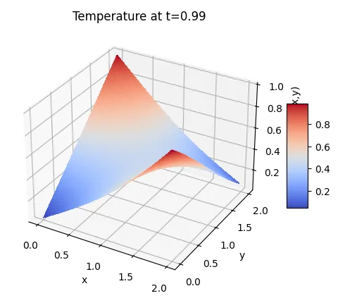

# CR_PINNS

Date de création: 31 mars 2025 07:28
Matière: IA
Statut: OK
Prof: EA
Type: TP

# Présentation Complète d'une Approche par PINN pour la Résolution du Problème de Transfert de Chaleur

Cette présentation se propose d'exposer en détail la logique sous-jacente au code d'un notebook dédié à la résolution du problème de transfert de chaleur à l'aide d'un réseau neuronal informé par la physique (Physics-Informed Neural Network, PINN). Nous aborderons l'architecture du modèle, la formulation des contraintes physiques, la procédure d'entraînement et les perspectives d'extension vers des problèmes en deux dimensions (2D). Enfin, nous proposerons des améliorations potentielles ainsi qu'une ouverture sur des axes de recherche complémentaires.

---

## Introduction

L'utilisation des réseaux de neurones informés par la physique représente une avancée majeure dans la résolution numérique de problèmes de mécanique, de transfert thermique et de dynamique des fluides. Contrairement aux approches purement data-driven, les PINN intègrent directement les lois physiques sous forme de contraintes dans la fonction de coût, ce qui permet de renforcer la robustesse et la cohérence des prédictions, même dans des contextes où les données expérimentales sont rares ou bruitées.

Dans le présent notebook, le problème étudié est celui du transfert de chaleur dans un domaine unidimensionnel (en x) puis bidimensionnel (x et y) évoluant dans le temps (t). L'objectif est d'approcher la solution de l'équation de la chaleur en tenant compte des conditions initiales et des conditions aux limites. La présentation qui suit explicite, de manière rigoureuse et argumentée, les différentes étapes de l'implémentation ainsi que les modalités d'extension du modèle au cas bidimensionnel.

---

## Contexte et Problématique Physique

Le problème de transfert de chaleur considéré s'exprime par une équation différentielle partielle (EDP) dont la formulation générale est la suivante :

$$

c\, \frac{\partial u}{\partial t} - \nabla \cdot \left( k \nabla u \right) + \beta (u - u_{\text{ref}}) = q(x,t)

$$

Dans ce TP, plusieurs simplifications ont été opérées afin de concentrer l'étude sur la mise en œuvre d'un PINN :

- **Conditions aux limites** :
    - $u(0,t) = B(1 - e^{-t/T_u})$ avec $B = 1$  et $T_u = 0.1$
    - $u(2,t) = 0$
- **Conditions initiales** :
    - $u(x,0) = 0$
- **Paramètres** :
    - Advection : $\beta = 3$ et $u_{\text{ref}} = 0$
    - Terme source : $q(x,t) = 0$
    - Domaine spatial et temporel : $x \in [0,2]$ et $t \in [0,1]$
- **Propriétés matérielles** :
    - La conductivité $k$ et la capacité calorifique $c$ sont, dans un premier temps, considérées constantes et égales à 1.

Cette configuration permet de se concentrer sur l'intégration de la physique dans l'optimisation du réseau et d'explorer l'impact des différentes composantes de la fonction de coût.

---

## Description Détaillée du Notebook

Le notebook se structure en plusieurs parties clés :

1. **Imports et Configuration**
    
    La première cellule importe les librairies nécessaires (PyTorch, NumPy, Matplotlib) et configure le dispositif de calcul (GPU ou CPU). Cette étape est cruciale pour assurer une exécution optimale des calculs, notamment lors de la rétropropagation dans les PINN.
    
2. **Fonction de Visualisation**
    
    La fonction `plot_forward` permet de visualiser la solution approchée par le réseau ainsi que, le cas échéant, la distribution des termes physiques tels que le terme source $q(x,t)$ et la conductivité $k(x)$.
    
3. **Définition du Problème Physique**
    
    La classe `forward_problem` encapsule la formulation physique du problème. Elle définit plusieurs méthodes :
    
    - `heat_source`: Retourne la valeur du terme source (initialement nul).
    - `advection`: Calcule le terme d'advection $\beta(u - u_{\text{ref}})$.
    - `conductivity` et `heat_capacity`: Renvoient respectivement la conductivité et la capacité calorifique, ici définies constantes.
    - `ic` et `bc`: Définissent les conditions initiales et aux limites.
    - `f`, `f_ic`, et `f_bc`: Calculent respectivement le résiduel de l'EDP, ainsi que les résiduels associés aux conditions initiales et aux limites.
    
    Cette encapsulation permet d'isoler la logique de la physique et de faciliter la modification ou l'extension du modèle.
    
4. **Définition du Réseau de Neurones**
    
    La classe `FCN` (Fully Connected Network) implémente un réseau de neurones classique avec deux couches cachées, utilisant des fonctions d'activation sigmoïde. Le choix des architectures et des paramètres reste un sujet de recherche, et des architectures plus profondes ou plus larges pourraient être envisagées selon la complexité du problème.
    
5. **Procédure d'Entraînement**
    
    La fonction `solve` orchestre l'entraînement du PINN en réalisant les étapes suivantes :
    
    - **Échantillonnage aléatoire** dans le domaine pour les points de collocation (utilisés pour évaluer le résiduel de l'EDP) ainsi que pour les conditions initiales et aux limites.
    - **Calcul de la perte (loss)** comme somme pondérée des erreurs sur le résiduel de la PDE, sur les conditions initiales et aux limites.
    - **Optimisation** via l'algorithme Adam, avec mise à jour itérative des paramètres du réseau.
    - **Affichage périodique** de la loss et visualisation de la solution pour suivre l'évolution de l'entraînement.
    
    
    
    Training loss itération n°1
    
    
    
    Training loss itération n°25
    
    
    
    Training loss itération n°200
    
6. **Instantiation et Exécution**
    
    La dernière cellule instancie le réseau, crée l'objet `forward_problem` et lance l'entraînement. Cette étape constitue la mise en application concrète de l'approche PINN.
    

---

## Explication du Code et Logique Sous-Jacente

### Intégration de la Physique dans le Modèle

Le cœur de l'approche PINN réside dans l'intégration des lois physiques directement dans la fonction de coût. Plutôt que de se contenter de minimiser une erreur entre des observations et une prédiction, le modèle minimise également le résiduel de l'équation différentielle qui régit le phénomène. Cela est réalisé via :

- **Calcul des dérivées** : L'utilisation de `torch.autograd.grad` permet de calculer automatiquement les dérivées partielles nécessaires pour évaluer $\frac{\partial u}{\partial t}$ et $\frac{\partial u}{\partial x}$. Ces dérivées servent à quantifier l'écart entre la prédiction du réseau et la loi de conservation de l'énergie exprimée par l'équation de la chaleur.
- **Formation du résiduel** : Le résiduel intègre la contribution de la capacité calorifique, du flux (qui dépend de la conductivité) et du terme d'advection. La somme de ces termes doit théoriquement être nulle pour toute solution exacte, d'où l'intérêt de minimiser l'erreur correspondante.
- **Conditions aux limites et initiales** : Le modèle intègre également les contraintes imposées par les conditions initiales (par exemple, $u(x,0)=0$ et aux limites (par exemple, $u(0,t)=1-e^{-t/0.1}$ et  $u(2,t)=0$. Ces conditions sont essentielles pour garantir la cohérence de la solution sur l'ensemble du domaine.

### Structure et Optimisation du Réseau

Le choix de l'architecture du réseau, ici un modèle entièrement connecté (FCN), repose sur plusieurs considérations :

- **Capacité d'approximation** : Le réseau doit être suffisamment complexe pour capturer la variabilité de la solution $u(x,t)$. Dans ce cas, deux couches cachées avec respectivement 100 et 10 neurones sont utilisées. Cette configuration peut être ajustée en fonction de la précision souhaitée.
- **Activation et non-linéarité** : Les fonctions d'activation (sigmoïde dans notre exemple) permettent d'introduire de la non-linéarité, essentielle pour modéliser des phénomènes complexes.
- **Optimisation** : La méthode d'optimisation Adam est utilisée pour mettre à jour les paramètres du réseau. L'utilisation d'un terme de décroissance du poids (weight decay) vise à régulariser l'entraînement et à prévenir le surapprentissage.

### Procédure d'Entraînement

L'entraînement du modèle se déroule par itérations successives, au cours desquelles :

- **Ré-échantillonnage aléatoire** : Les points de collocation sont renouvelés à chaque itération afin de couvrir de manière exhaustive l'espace des entrées. Cela permet de réduire la dépendance à une grille fixe et d'améliorer la généralisation du modèle.
- **Calcul des différentes pertes** : La loss globale est constituée de la somme de la perte sur l'EDP (PDE loss), de la perte sur les conditions initiales (IC loss) et de la perte sur les conditions aux limites (BC loss). Ce choix de formulation garantit que la solution respecte simultanément les lois physiques et les contraintes de bord.

> L’évolution de la loss est représenté ci-dessous
> 
> 
> 
> 

- **Backpropagation et mise à jour des poids** : Le calcul des gradients est effectué par rétropropagation, suivie de la mise à jour itérative des paramètres via Adam. La convergence du modèle est contrôlée par l'affichage périodique de la loss.

### Analyse de l’entraînement

On peut afficher l’évolution au cours des epochs des différents termes de loss afin de mieux saisir les différentes conditions que doit respecter le réseau. On travail dans cet exemple sur des conditions aux limites plus complexes que précédemment afin d’obtenir un profil de température plus intéressant.


> **Remarque** : On constate que le terme le plus important de la loss est le terme de condition aux limites. Le réseau semble n’avoir aucun mal à trouver des données qui vérifient l’équation de la chaleur (terme PDE faible) mais c’est l’ajout des conditions initiales et limites qui va demander au réseau plus d’entraînement avant de converger. Ici chaque terme de loss a le même poids dans la loss total mais il est possible d’y ajouter une pondération.
> 

---

## Extension du Modèle à un Problème en 2D

L'extension d'un PINN d'un problème 1D à un problème en deux dimensions représente une évolution naturelle pour traiter des phénomènes spatiaux plus complexes. Pour passer en 2D, plusieurs modifications doivent être envisagées :

1. **Modification de l'Entrée du Réseau**
    - **Actuellement** : Le réseau prend en entrée deux variables $(x, t)$.
    - **Pour 2D** : Il faudra inclure une troisième variable, par exemple $y$, pour représenter la deuxième dimension spatiale. Ainsi, les entrées deviendront $(x, y, t)$.
2. **Adaptation de l'Architecture**
    - Le réseau devra être redéfini pour accepter des tenseurs d'entrée de dimension 3. Les couches denses devront alors s'adapter à cette nouvelle taille d'entrée.
    - La complexité du modèle pourrait être augmentée en ajoutant davantage de couches ou de neurones pour capturer les interactions spatiales plus riches en 2D.
3. **Réécriture des Contraintes Physiques**
    - La formulation de l'EDP devra être adaptée pour inclure les dérivées par rapport à $y$. Par exemple, le terme de diffusion se généralise en :
        
        $$
        \nabla \cdot (k \nabla u) = \frac{\partial}{\partial x}\left(k\, \frac{\partial u}{\partial x}\right) + \frac{\partial}{\partial y}\left(k\, \frac{\partial u}{\partial y}\right)
        
        $$
        
    - Les conditions aux limites devront être spécifiées pour les bords du domaine en $x$ et en $y$.
4. **Échantillonnage dans l'Espace 2D**
    - L'échantillonnage aléatoire devra désormais porter sur un maillage dans le plan $(x, y)$ ainsi que dans le temps $t$. Les points de collocation devront être générés sur un domaine $[x_{\text{min}}, x_{\text{max}}] \times [y_{\text{min}}, y_{\text{max}}] \times [0,T]$.
5. **Visualisation de la Solution en 2D**
    - Pour visualiser la solution $u(x,y,t)$ en 2D, plusieurs approches sont possibles : des coupes en 2D à des instants donnés, des surfaces en 3D (par exemple, en fixant $t$ ou des animations temporelles.
    
    > Suggestion d'insertion d'image : Vous pouvez insérer des captures d'écran de visualisations 2D obtenues avec Matplotlib, accompagnées de légendes explicatives.
    > 

---

### Ajout de coefficient pour pondérer les différents termes de loss

Notre condition initiale imposée est une température nulle en tous points à $t=0$. Les conditions aux bords exponentielles définies par la fonction suivante :

```python
def bc(self,x,y,t):
  #conditions aux limites
  Tu = 0.1
  B=1
  bc = torch.where(x==0,B*y*0.5*(1-torch.exp(-t/Tu)),torch.where(x==2,B*(1 - 0.5*y)*(1-torch.exp(-t/Tu)),0.0))

  return bc
```

Après entrainement on observe le profil de température suivant :


Profil de température à $t=0$ pour des conditions initiales nulles et des conditions au bord exponentielles (sur les plans x=0 et x=1)



Profil de température à $t=0.99$ pour des conditions initiales nulles et des conditions au bord exponentielles (sur les plans x=0 et x=1)

On constate que la température initiale n’est pas parfaitement nulle, en particulier sur les bords ou elle atteint 0.15 (sachant que la valeur finale est de 1) ce qui est non négligeable. Pour pallier ce problème, on peut essayer d’ajouter un coefficient devant le terme condition initiale, par exemple

```python
loss = mse_f + 2*mse_ic + mse_bc
```


Profil de température à $t=0$ pour des conditions initiales nulles et des conditions au bord exponentielles (sur les plans x=0 et x=1) et pondération sur CI


Profil de température à $t=0.99$ pour des conditions initiales nulles et des conditions au bord exponentielles (sur les plans x=0 et x=1) et pondération sur CI


Evolution de la loss après ajout d’un terme de pondération sur le respect des conditions initiales

On constate une légère amélioration du respect des conditions initiales (on passe de 0.15 au maximum à $t=0$ à 0.125). Toutefois la condition finale est désormais moins bien respectée (on atteint une température de 0.8 alors qu’on impose 1 aux limites). Ce problème illustre bien la complexité du réglage d’un PINN : obtenir un réseau qui prédit à peu près bien la température dans un plan se fait bien. En revanche si on impose dans le cahier des charges un respect strict des conditions initiales ou finales, alors il devient difficile d’obtenir un réseau bon sur le respect des 3 critères (PDE, conditions initiales et aux frontières). 

## Simulation d’un écoulement incompressible autour d’une sphère en 2D

### Contexte et objectifs

L’objectif principal de ce projet était de modéliser un écoulement de fluide autour d’un obstacle en imposant rigoureusement les lois physiques. Le problème physique s’appuie sur les équations de Navier–Stokes stationnaires pour un fluide incompressible, lesquelles se formalisent comme suit :

1. **Équation de continuité (incompressibilité) :**
    
    $$
    
    \nabla \cdot \mathbf{u} = \frac{\partial u}{\partial x} + \frac{\partial v}{\partial y} = 0
    
    $$
    
2. **Éq**uations de la dynamique :
- Pour la composante $x$ :
    
    $$
    u\frac{\partial u}{\partial x} + v\frac{\partial u}{\partial y} = -\frac{\partial p}{\partial x} + \nu \left( \frac{\partial^2 u}{\partial x^2} + \frac{\partial^2 u}{\partial y^2} \right)
    $$
    
- Pour la composante $y$ :
    
    $$
    u\frac{\partial v}{\partial x} + v\frac{\partial v}{\partial y} = -\frac{\partial p}{\partial y} + \nu \left( \frac{\partial^2 v}{\partial x^2} + \frac{\partial^2 v}{\partial y^2} \right)
    $$
    

où $\mathbf{u} = (u,v)$ représente le champ de vitesse, $p$ la pression, et $\nu$ la viscosité cinématique, fixée ici à $\nu=0.005$ afin de mieux révéler le sillage derrière l'obstacle.

Les conditions aux limites imposées sont les suivantes :

- **Entrée (x=0) :** $u=1$ et $v=0$ (injection horizontale).
- **Sortie (x=1) :** $p=0$ (condition de pression nulle) avec des conditions de dérivée nulle pour la vitesse.
- **Parois horizontales (y=0 et y=1) :** conditions no-slip $u=0, v=0$.
- **Obstacle (sphère) :** aucun fluide n'est présent à l'intérieur du cercle de rayon $r=0.15$ centré en $(0.5,0.5)$ ; sur la frontière, la condition no-slip impose $u=0, v=0$ et la composante normale du vecteur vitesse est pénalisée.

---

## Démarche et Difficultés Rencontrées

### 1. Formalisation du Problème

La première difficulté consistait à intégrer correctement l'obstacle dans le domaine de calcul. En effet, dans une approche classique, le réseau entraîné pouvait produire des champs de vitesse et de pression même à l'intérieur de l'obstacle, ce qui n'a pas de sens physique pour un solide imperméable. Pour remédier à cela, nous avons mis en place deux stratégies complémentaires :

- **Filtrage géométrique :** Lors de l'échantillonnage des points pour la résolution de la PDE, nous avons exclu explicitement les points situés à l'intérieur du cercle défini par \\((x-0.5)^2 + (y-0.5)^2 < 0.15^2\\). Ce filtrage garantit que la fonction de perte de la PDE ne s'applique que dans la région fluide.
- **Pénalisation intérieure :** Nous avons ajouté un terme dans la fonction de perte qui contraint le champ de vitesse à être nul pour des points échantillonnés à l'intérieur de l'obstacle. Ainsi, si le réseau propose des valeurs non-nulles dans cette zone, la perte pénalisera fortement ce comportement.
- **Condition sur la frontière de l'obstacle :** Nous avons renforcé la pénalisation sur la composante normale (calculée à l'aide de l'angle  $\theta$ correspondant à la position sur le cercle) afin d'imposer la condition no-slip sur la surface de l'obstacle.

### 2. Mise en Œuvre Technique

Parmi les difficultés techniques rencontrées, l'une des erreurs notables était liée à la manipulation des tenseurs lors de l'échantillonnage et du filtrage. Après application d'un masque booléen, les tenseurs perdaient leur dimension d'origine, ce qui entraînait des erreurs lors de la concaténation dans le réseau. La solution a consisté à reformater ces tenseurs (en utilisant par exemple `view(-1, 1)`) afin de conserver la dimension attendue.

### 3. Réseau et Paramètres d'Entraînement

Le réseau utilisé est un FCN (Fully Connected Network) défini par plusieurs couches entièrement connectées avec des fonctions d'activation $\tanh$. La structure du réseau est la suivante :

- **Entrée :** Les coordonnées $(x,y)$ de dimension $2$.
- **Couches cachées :** Deux à trois couches avec respectivement 128, 128 et 64 neurones.
- **Sortie :** Un vecteur de dimension $3$ correspondant aux composantes $u, v$ et à la pression $p$.

Les paramètres d'entraînement comprennent :

- **Optimiseur :** Adam avec un taux d'apprentissage de $1 \times 10^{-3}$.
- **Nombre d'itérations :** Généralement entre 3000 et 5000 itérations.
- **Fonction de perte :** La loss totale est la somme des pertes sur la PDE, sur les conditions aux limites (inlet, outlet, parois, et obstacle) et sur la pénalisation à l'intérieur de la sphère.

---

## Équations du Modèle et Implémentation

La fonction de perte totale est définie par :

$$
\text{Loss}_{\text{total}} = \text{loss}_{\text{pde}} + \text{loss}_{\text{inlet}} + \text{loss}_{\text{outlet}} + \text{loss}_{\text{top-bottom}} + \text{loss}_{\text{sphere}} + \text{loss}_{\text{interior}}

$$

où :

- $\text{loss}_{\text{pde}}$ est basée sur les résidus des équations de continuité et de la dynamique :
    
    $$
    \begin{aligned}
    \text{loss}_{\text{pde}} &= \text{MSE}\left( \frac{\partial u}{\partial x} + \frac{\partial v}{\partial y}, 0 \right) \\[1mm]
    &+ \text{MSE}\left( u\,\frac{\partial u}{\partial x} + v\,\frac{\partial u}{\partial y} + \frac{\partial p}{\partial x} - \nu \left( \frac{\partial^2 u}{\partial x^2} + \frac{\partial^2 u}{\partial y^2} \right), 0 \right) \\[1mm]
    &+ \text{MSE}\left( u\,\frac{\partial v}{\partial x} + v\,\frac{\partial v}{\partial y} + \frac{\partial p}{\partial y} - \nu \left( \frac{\partial^2 v}{\partial x^2} + \frac{\partial^2 v}{\partial y^2} \right), 0 \right)
    \end{aligned}
    $$
    
- $\text{loss}_{\text{inlet}}$ impose `u=1, v=0` sur `x=0`.
- $\text{loss}_{\text{outlet}}$ impose `p=0` sur `x=1`.
- $\text{loss}_{\text{top-bottom}}$ impose `u=0, v=0` sur `y=0` et `y=1`.
- $\text{loss}_{\text{sphere}}$ pénalise la composante normale non nulle sur la frontière de la sphère :
    
    $$
    \text{loss}_{\text{sphere}} = \text{MSE}\left( u\cos\theta + v\sin\theta, 0 \right)
    $$
    
- $\text{loss}_{\text{interior}}$ force `u=0, v=0` pour les points à l'intérieur du cercle (`(x-0.5)^2+(y-0.5)^2 < 0.15^2`).

Ces formulations garantissent que le modèle respecte les lois de la mécanique des fluides et que le fluide est exclu de l'obstacle solide.

---

### Résultats de la simulation

**Epoch 0, Loss: 1.152615**


**Epoch 2000, Loss: 0.217879**


## Conclusion

Nous avons développé un modèle PINN pour simuler un écoulement incompressible autour d'un obstacle 2D. Les principaux défis concernaient l'intégration de l'obstacle et le traitement des données. Notre approche a consisté à :

- Filtrer les points d'échantillonnage hors de l'obstacle
- Pénaliser la vitesse dans et sur l'obstacle
- Optimiser la structure et l'entraînement du réseau

Le FCN multicouche avec activations $\tanh$ a été entraîné via Adam (learning rate $1 \times 10^{-3}$, 3000-5000 itérations). Les résultats montrent des champs de vitesse et pression cohérents avec la physique du problème.

## Améliorations Éventuelles et Perspectives de Recherche

Plusieurs pistes peuvent être explorées pour améliorer le modèle :

- L’architecture du PINN peut être modifiée : choix de la fonction d’activation, des coefficients de pondérations sur la loss etc. (voir le papier [Auto PINN](https://arxiv.org/pdf/2205.13748) pour l’étude d’un réglage automatique des hyperparamètres)
- Taille du réseau : nombre de couche et de réseau
- Adaptation dynamique des pondérations entre termes de la loss
- Durée et données d’entrainement
    
    Une autre piste d’amélioration pourrait être d’utiliser un Neural ODE pour simuler ce genre de problème physique. Les neural ODE ont été introduit dans [ce papier](https://arxiv.org/abs/1806.07366) et semble plus adapté à la modélisation d’équations différentielles, la où un MLP classique peut peiner à modéliser des comportement continus du fait de leur discrétisation régulière
    
    
    
    suivi d’une trajectoire complexe par (a) un RNN classique et (b) un neural ODE avec des points de sampling irrégulier sur les trajectoires (figure 8 de Neural Ordinary Differential Equations)
    
    
    
    Gauche : Un RNN définit une séquence de transformation finie et régulière. Droite : Un réseau ODE définit un champ de vecteur qui transforme de manière plus continue l’état du système. Les cercles représentent l’évaluation en différents points (figure 1 de Neural Ordinary Differential Equations)
    

---

## Conclusion

Cette présentation détaillée a mis en lumière la logique et les fondements scientifiques du code développé pour la résolution d'un problème de transfert de chaleur à l'aide d'un PINN. Nous avons expliqué chaque étape du processus, depuis la formulation du problème physique et la définition des contraintes, jusqu'à l'implémentation du réseau neuronal et la procédure d'entraînement. Nous avons également discuté des pistes d'extension vers des problèmes en 2D et proposé diverses améliorations potentielles qui pourraient être explorées dans un cadre de recherche avancé.

En intégrant les lois physiques directement dans le processus d'apprentissage, les PINN constituent une approche prometteuse pour traiter des phénomènes complexes, offrant une meilleure généralisation et une plus grande robustesse face aux données bruitées.